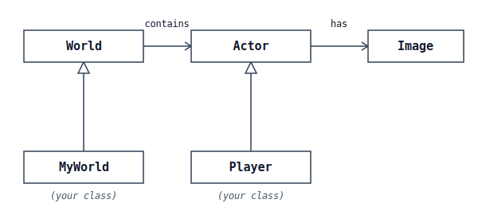
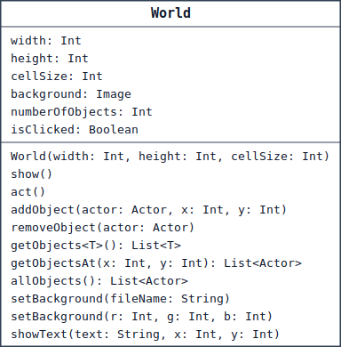
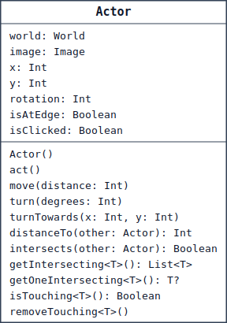
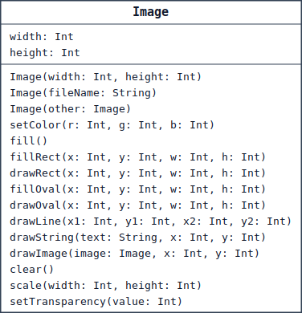

# BluePlay

A small **Kotlin game framework for [BlueJ](https://www.bluej.org/)** – a didactic alternative to Greenfoot (which doesn't exist for Kotlin). It lets you
program simple graphical games and simulations without installing or
configuring anything beyond BlueJ itself.

Perhaps "framework" sounds a little too much or too big. A BluePlay project is an ordinary BlueJ project, but already contains some classes and other files.

> Built for the German-language inf-schule.de chapter:
> [„OOP mit Kotlin"](https://www.inf-schule.de/oopk) (work in progress)

> **Requirement:** BlueJ with Kotlin support (BlueJ version 6 or later).

**Contents:** [Getting started](#download--getting-started) ·
[Minimal example](#minimal-example) ·
[Project structure](#how-a-blueplay-project-is-structured) ·
[World](#world) · [Actor](#actor) · [Image](#image) ·
[Global functions](#global-functions)

## Download & getting started

1. Download this repository as a ZIP (green **Code → Download ZIP** button, or
   [direct download link](https://github.com/tomkarp/BluePlay/archive/refs/heads/main.zip)) and unpack it.
2. Open the unpacked folder in BlueJ.
3. Right-click **`Main`** → `main()` – the world appears. Then click **Start**
   at the bottom of the window.

The window has a Greenfoot-style control bar:

| Button | Effect |
|---|---|
| **Step** | runs a single step (`act` once) |
| **Start / Stop** | game runs (`act` repeatedly) or pauses |
| **Reset** | reloads by running `main()` again |
| **Speed** | simulation speed |

## Minimal example

```kotlin
class MyWorld : World(600, 400, 1) {
    init {
        addObject(Figure(), 100, 200)
    }
}

class Figure : Actor() {
    init {
        image = Image("figure.png")
    }
    override fun act() {
        move(1)   // walks slowly to the right
    }
}

fun main() {
    val world = MyWorld()
    world.show()
}
```

## How a BluePlay project is structured

A BluePlay project always consists of the framework classes (`World`, `Actor`,
`Image`) and your own classes. There's also `BluePlayFunctions`, a file that
contains global functions, e.g. for reading the keyboard and playing sounds.

The classes work together like this:



An `Actor` has an image (`Image`) and lives in a `World`. A `World` contains
any number of `Actor` objects. Your classes inherit from `World` and `Actor`.

### Your own world

Your own world is a subclass of `World`. In the constructor you set its size:
width and height in cells, and the size of one cell in pixels.

```kotlin
class MyWorld : World(600, 400, 1) {
}
```

### Your own figure

A figure is a subclass of `Actor`. It gets an image and describes, in the
method `act()`, what should happen on every step. `act()` is called
automatically, over and over, while the game is running.

```kotlin
class Player : Actor() {
    init {
        image = Image("player.png")
    }

    override fun act() {
        if (isKeyDown("right")) x += 3
    }
}
```

### The main program

In the main program you create the world, add figures with `addObject(...)`,
and display the world with `show()`. A world never shows itself automatically.

Clicking Reset calls the `main()` function in the file `Main` again.

```kotlin
fun main() {
    val world = MyWorld()
    world.addObject(Player(), 300, 200)
    world.show()
}
```

## World

A `World` is the playfield: a grid of `width` × `height` cells, where each
cell is `cellSize` pixels in size. Your own world is a subclass of `World`.



The `<T>` in `getObjects` is a placeholder for a type: at the call site you
plug in the class you want. `getObjects<Coin>()`, for example, returns all
coins.

### Examples

```kotlin
// A world with 600x400 cells (1 pixel each)
class MyWorld : World(600, 400, 1)
```

```kotlin
// Create a world, add an object, and show it
val world = MyWorld()
world.addObject(Player(), 300, 200)
world.show()
```

### API

| **Attributes** | |
|---|---|
| `width, height, cellSize: Int` | Width and height of the field (in cells) and the size of one cell (in pixels). Set in the constructor. |
| `background: Image` | The world's background image. |
| `numberOfObjects: Int` | Number of actor objects currently in the world. |
| `isClicked: Boolean` | `true` if the world itself (not an actor) was just clicked. |
| **Constructor** | |
| `World(width: Int, height: Int, cellSize: Int)` | Creates a world with width × height cells of cellSize pixels each. |
| **Methods** | |
| `show()` | Shows the world in the game window. A world does not show itself automatically. |
| `act()` | Called on every step. Override to program the behaviour of the whole world. |
| `addObject(actor: Actor, x: Int, y: Int)` | Adds an actor to the world at position (x, y). |
| `removeObject(actor: Actor)` | Removes an actor from the world. |
| `getObjects<T>(): List<T>` | Returns all actor objects of type T, e.g. `getObjects<Coin>()`. |
| `getObjectsAt(x: Int, y: Int): List<Actor>` | Returns all actor objects in cell (x, y). |
| `allObjects(): List<Actor>` | Returns all actor objects in the world. |
| `setBackground(fileName: String)` | Loads an image as the background and scales it to the world size. |
| `setBackground(r: Int, g: Int, b: Int)` | Fills the background with a color (r, g, b each 0..255). |
| `showText(text: String, x: Int, y: Int)` | Shows text at cell (x, y). `""` removes the text there again. |

## Actor

An `Actor` is a figure that lives in a `World` and has an image. Your own
figures are subclasses of `Actor` and override the method `act()`. The
position (`x`, `y`) is given in cells.



The `<T>` (e.g. in `getOneIntersecting`) is a placeholder for a type: at the
call site you plug in the class you want. `getOneIntersecting<Coin>()`, for
example, returns a touched coin.

### Examples

```kotlin
// A coin that slowly turns on every step
class Coin : Actor() {
    init {
        image = Image("coin.png")
    }

    override fun act() {
        turn(3)
    }
}
```

```kotlin
// In a figure's act(): collect a touched coin
val coin = getOneIntersecting<Coin>()
if (coin != null) {
    world.removeObject(coin)
}
```

### API

| **Attributes** | |
|---|---|
| `world: World` | The world this actor is in. |
| `image: Image` | The actor's image (appearance). |
| `x, y: Int` | Position in cells. Automatically clamped to the world boundaries. |
| `rotation: Int` | Heading in degrees (0 = right, clockwise). |
| `isAtEdge: Boolean` | `true` if the actor is at the edge of the world. |
| `isClicked: Boolean` | `true` if this actor was just clicked. |
| **Constructor** | |
| `Actor()` | Creates a new figure. Set its image afterwards via the `image` attribute (usually in the `init` block). |
| **Methods** | |
| `act()` | Called on every step. Override to program the figure's behaviour. |
| `move(distance: Int)` | Moves the actor by `distance` cells in its current heading. |
| `turn(degrees: Int)` | Turns the heading by `degrees`. |
| `turnTowards(x: Int, y: Int)` | Turns the heading towards cell (x, y). |
| `distanceTo(other: Actor): Int` | Distance to another actor (in cells). |
| `intersects(other: Actor): Boolean` | `true` if this actor's image overlaps the other actor's image. |
| `getIntersecting<T>(): List<T>` | All overlapping actor objects of type T. |
| `getOneIntersecting<T>(): T?` | One overlapping actor of type T, or `null`. |
| `isTouching<T>(): Boolean` | `true` if at least one actor of type T overlaps. |
| `removeTouching<T>()` | Removes one overlapping actor of type T from the world. |

## Image

An `Image` is a picture. It serves as the appearance of an `Actor` object or
the background of a `World`. You can load an image from a file or draw on it
yourself.



### Examples

```kotlin
// Load an image from a file (from the images/ folder)
image = Image("player.png")
```

```kotlin
// Draw an image yourself: a red circle, 30x30 pixels
val picture = Image(30, 30)
picture.setColor(255, 0, 0)
picture.fillOval(0, 0, 30, 30)
image = picture
```

### API

| **Attributes** | |
|---|---|
| `width, height: Int` | Width and height of the image, in pixels. |
| **Constructors** | |
| `Image(width: Int, height: Int)` | Creates an empty, transparent image of the given size (in pixels). |
| `Image(fileName: String)` | Loads an image from a file (e.g. PNG) in the `images/` folder. |
| `Image(other: Image)` | Creates a copy of an existing image. |
| **Methods** | |
| `setColor(r: Int, g: Int, b: Int)` | Sets the drawing color (r, g, b each 0..255). |
| `fill()` | Fills the whole image with the drawing color. |
| `fillRect(x: Int, y: Int, w: Int, h: Int)` | Draws a filled rectangle. |
| `drawRect(x: Int, y: Int, w: Int, h: Int)` | Draws the outline of a rectangle. |
| `fillOval(x: Int, y: Int, w: Int, h: Int)` | Draws a filled oval. |
| `drawOval(x: Int, y: Int, w: Int, h: Int)` | Draws the outline of an oval. |
| `drawLine(x1: Int, y1: Int, x2: Int, y2: Int)` | Draws a line. |
| `drawString(text: String, x: Int, y: Int)` | Writes text at position (x, y). |
| `drawImage(image: Image, x: Int, y: Int)` | Draws another image at position (x, y). |
| `clear()` | Makes the image fully transparent. |
| `scale(width: Int, height: Int)` | Scales the image to a new size. |
| `setTransparency(value: Int)` | Opacity from 0 (invisible) to 255 (opaque). |

## Global functions

Besides the classes, BluePlay has a few global functions. They don't belong to
any class and live in the file `BluePlayFunctions`. You can call them directly
anywhere — for example `isKeyDown("up")` inside a figure's `act()`.

### Examples

```kotlin
// In a figure's act(): move up/down with the arrow keys
override fun act() {
    if (isKeyDown("up"))   y -= 3
    if (isKeyDown("down")) y += 3
}
```

```kotlin
// Play a sound (from the sounds/ folder)
playSound("pickup.wav")
```

### API

| **Functions** | |
|---|---|
| `isKeyDown(key: String): Boolean` | `true` while the key is held down. Names include `"left"`, `"right"`, `"up"`, `"down"`, `"space"`, `"enter"`, and single characters such as `"a"` or `"7"`. |
| `start()` | Starts the game (calls `act()` continuously). |
| `stop()` | Stops the game. |
| `step()` | Runs exactly one step. |
| `getSpeed(): Int` | Returns the current speed (1..100). |
| `setSpeed(value: Int)` | Sets the speed (1..100). |
| `playSound(fileName: String)` | Plays a WAV file from the `sounds/` folder once. |

## License

[MIT](../LICENSE) © Thomas Karp
